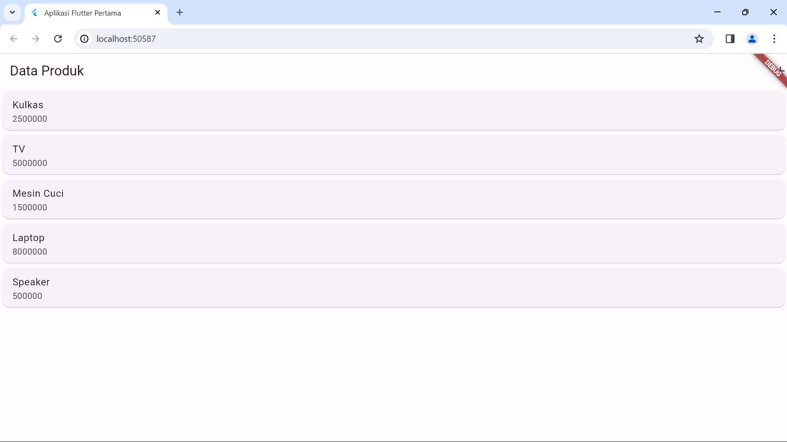
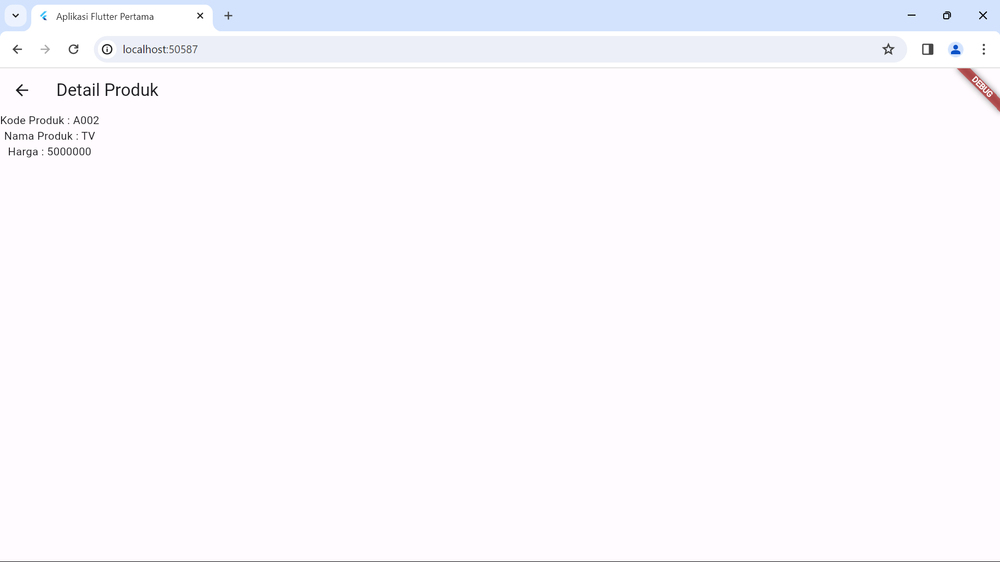

# product_uts_mobile2

|             |                        |     |
| ----------- | ---------------------- | --- |
| Nama        | Muhammad Riyadus Solihin |
| NIM         | 312210404              |
| Kelas       | TI.22.A.4              |
| Mata Kuliah | Pemograman Mobile 2    |

## Aplikasi Mobile dengan **Flutter**

- **Install Flutter**  
  
Flutter adalah sebuah framework open-source yang dikembangkan oleh Google untuk
  membangun antarmuka (user interface/UI) aplikasi Android dan iOS.
  Apa bedanya membuat aplikasi android menggunakan Java/Kotlin (native) dengan Flutter.
  Dari bahasa pemrograman yang digunakan, Flutter menggunakan bahasa pemrograman Dart,
  sedangkan Android Native menggunakan bahasa pemrograman Java dan Kotlin. Aplikasi yang
  kita buat dengan Flutter dapat di-build ke Android dan iOS. Sedangkan Android Native hanya
  bisa di-build ke Android saja. Link download flutter https://flutter.dev/docs/get-started/install

## Hasil Run Program

